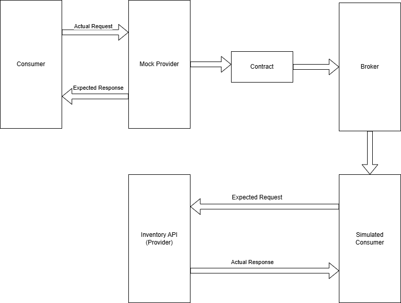
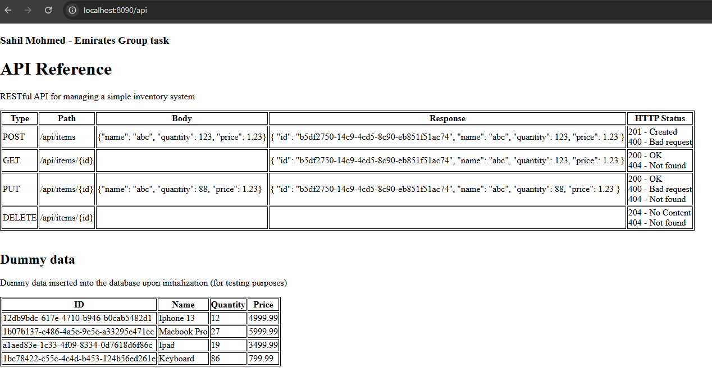
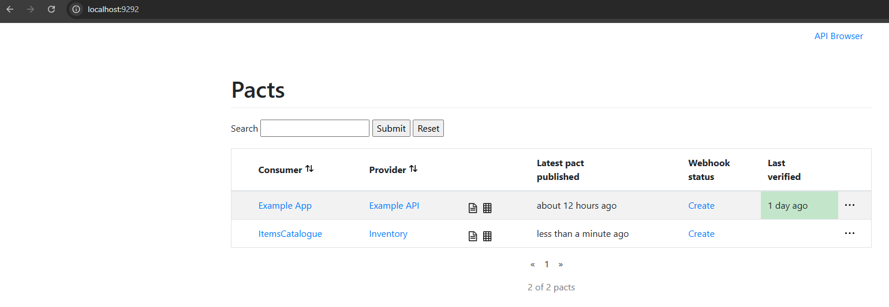
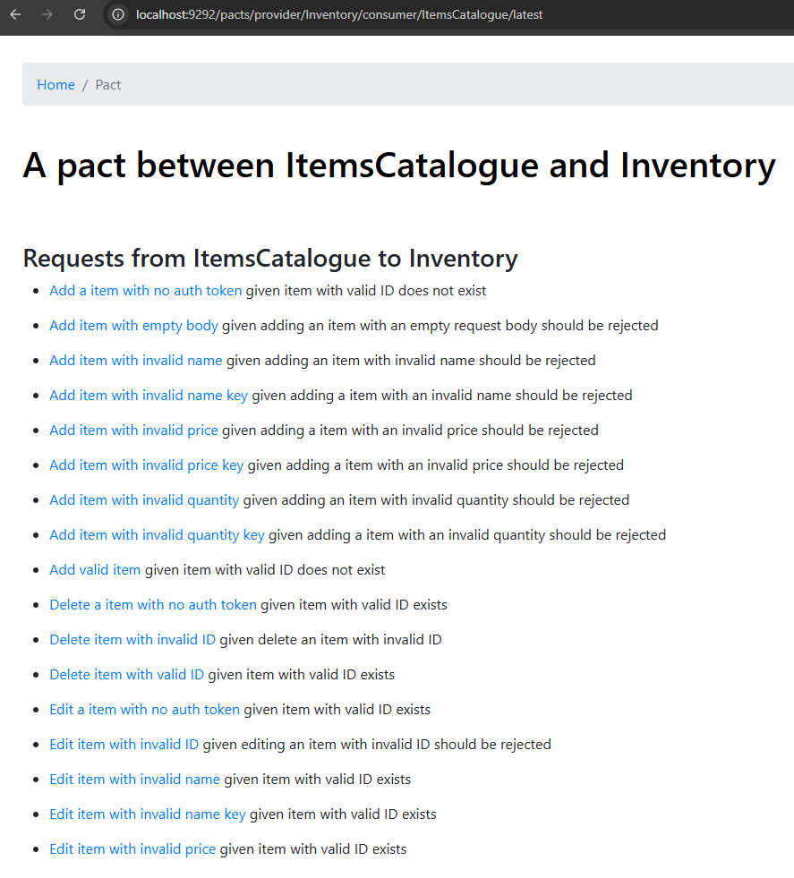
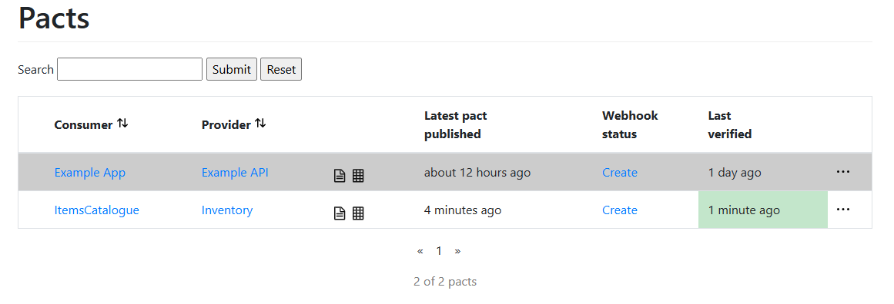
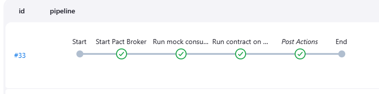
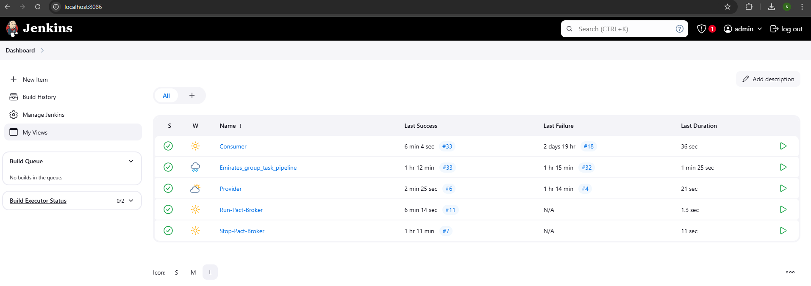

# Contract Testing
Sahil Mohmed

Task to create a RESTful API for managing a simple inventory system. API endpoints should allow to add items, get items, edit items, and delete items. 
Contract testing must be implemented to verify the interactions between the API and the consumer. 

## Contract Testing Approach
There are multiple tools and frameworks designed for contract testing, but for this task i have selected **Pact** 
which is open source and very well supported, it also integrates easily into the Spring boot framework. Pact is a consumer driven tool, which means the consumer will produce the contract and the provider will have to adhere to it. There are other tools like Spring Cloud Contract, but they generally focus on the provider side. 

My approach to contract testing involves having three seperate entities:
 
1. **Consumer** - the consumer runs tests against a **mock** provider API which has been designed to always provide the expected results. Once the tests have been completed, a contract will be generated (Pact json file).
2. **Pact Broker** - the Pact broker is a web app which allows the consumer to share contacts with the provider. It also allows the provider to publish results. 
3. **Provider** - the provider is the real API, the contracts are tested agains the real API. 
   
   

## Brief Repo Contents
In the real world, the Consumer and Provider would be on seperate repos, however for this task i have put them both on a single repo to keep things simple. 
Contents: 
1. **consumer** - contains a Spring boot Maven project which uses a mock server to test against a RestTemplate. 
2. **inventory_api** (provider) - contains a Spring boot Maven project which hosts an API and web page (Thymeleaf). The real API is hosted using this project and the contracts are tested against it. 
3. **docker-compose.yml** - docker container to host the Pact Broker.
   
## Inventory API (Provider)
This project is where the real API is hosted using a `@RestController`:
 

    @RestController
    @RequestMapping("/api")
    public class AppRestController {

        @Autowired
        private InventoryRepository repository;

        /**
        * Adding a new item to the inventory
        * 
        * @param input
        * @return 201 Created status with the new item as the response
        */
        @RequestMapping(method = RequestMethod.POST, value = "/items")
        public ResponseEntity<?> addItem(@RequestBody Inventory input) {
            if (!isValid(input)) {
                return new ResponseEntity<>("Invalid input data", HttpStatus.BAD_REQUEST);
            }
            return new ResponseEntity<>(repository.save(input), HttpStatus.CREATED);
        }

Data is stored into an in memory H2 database, the data is modelled as a Spring `@Entity` to allow for easy mapping between tables and objects:

    @Entity
    @Table(name = "Inventory")
    public class Inventory {....
    .....
    }

To allow for CRUD storage operations - i have created an interface which extends `CrudRepository`:
 

    public interface InventoryRepository extends CrudRepository<Inventory, String> {
        Optional<Inventory> findById(String id);
    }

To initialize some dummy data for testing purposed, i have added a `data.sql` file into resources. The following dummy data is initialized into the database:
 

    INSERT INTO Inventory (id, name, quantity, price) VALUES ('12db9bdc-617e-4710-b946-b0cab5482d1', 'Iphone 13', '12', '4999.99')
    INSERT INTO Inventory (id, name, quantity, price) VALUES ('1b07b137-c486-4a5e-9e5c-a33295e471cc', 'Macbook Pro', '27', '5999.99')
    INSERT INTO Inventory (id, name, quantity, price) VALUES ('a1aed83e-1c33-4f09-8334-0d7618d6f86c', 'Ipad', '19', '3499.99')
    INSERT INTO Inventory (id, name, quantity, price) VALUES ('1bc78422-c55c-4c4d-b453-124b56ed261e', 'Keyboard', '86', '799.99')

<table>
<tr>
    <th>ID</th>
    <th>Name</th>
    <th>Quantity</th>
    <th>Price</th>
</tr>
<tr>
    <td>12db9bdc-617e-4710-b946-b0cab5482d1</td>
    <td>Iphone 13</td>
    <td>12</td>
    <td>4999.99</td>
</tr>
<tr>
    <td>1b07b137-c486-4a5e-9e5c-a33295e471cc</td>
    <td>Macbook Pro</td>
    <td>27</td>
    <td>5999.99</td>
</tr>
<tr>
    <td>a1aed83e-1c33-4f09-8334-0d7618d6f86c</td>
    <td>Ipad</td>
    <td>19</td>
    <td>3499.99</td>
</tr>
<tr>
    <td>1bc78422-c55c-4c4d-b453-124b56ed261e</td>
    <td>Keyboard</td>
    <td>86</td>
    <td>799.99</td>
</tr>
</table>
 

I have also implemented a front end API reference using a `@Controller`, this uses `Thymeleaf` to publish the html page. 
 

    @Controller
    public class AppController {
        /**
        * Get api reference
        * @return api reference page
        */
        @RequestMapping("/api")
        public String getApiRef() {
            return "apiref";
        }

   

The Pact verification tests use JUnit5 annotations to setup the class and to define the test methods: 
 
`@SpringBootTest` - to define that the class is a Spring boot test. 
 
`@Provider` - Pact JUnit5 annotation to define the name of the provider - only contracts that are setup for this provider will be tested.
 
`@PactBroker` - contains the access details for the Pact broker.
 
`@IgnoreMissingStateChange` - this will continue testing even if a Pact test requres a State change which is missing.
 
`@BeforeEach` - Runs methods before each test.
 
`@TestTemplate` - This is where Pact will run the tests using the contract.
 
`@State` - Some Pact tests require the API to be in a certain state before running the test. This annotation allows for state changes. 
 
 
I have also implemented Web security config for Bearer token authorization (see Authorization chapter below)

## Consumer Mock
This is where the consumer tests are written and tested against a mock API. 
A `@Service` client has been implemented to serve the mock server requests using a rest template:
 

    @Service
    public class ItemServiceClient {
    @Autowired
    private RestTemplate restTemplate;

    @Value("${serviceClients.inventory.baseUrl}")
    private String baseUrl;

    /**
    * Post an item to rest template
    * 
    * @param itemMap - Json object
    * @return response entity with Item type
    * @throws JsonProcessingException
    */
    public ResponseEntity<Item> postItem(ObjectNode itemMap) throws JsonProcessingException {
        ResponseEntity<Item> entity = restTemplate.exchange(baseUrl + "/api/items", HttpMethod.POST,
            new HttpEntity<>(itemMap, auth()), Item.class);
        return entity;
    }

The data model is a simple `@Data` Lombok DTO which allows to easily map to an object without needed to manually define setters and getters. 
 

    @Data
    public class Item {
    private final String id;
    private final String name;
    private final int quantity;
    private final float price;
    }

None of the data is being stored so there is no need for a repository on the consumer side. 

The Pact tests are created as a `@SpringBootTest` which extends the `PactConsumerTestExt` class. 
In order to create the test, first a `@Pact` needs to be created which builds a domain specific language using `PactDslWithProvider`. 
 

    @Pact(consumer = "ItemsCatalogue")
    public RequestResponsePact singleItem(PactDslWithProvider builder) {
        return builder
                .given("item with valid ID and body exists", "id",
                        VALID_ID, "name", VALID_NAME, "quantity", VALID_QUANTITY, "price", VALID_PRICE)
                .uponReceiving("get item with valid ID")
                .path("/api/items/" + VALID_ID)
                .matchHeader("Authorization", "Bearer [a-zA-Z0-9=\\+/]+", "Bearer AAABd9yHUjI=")
                .willRespondWith()
                .status(200)
                .headers(itemService.getJsonHeader())
                .body(
                        new PactDslJsonBody()
                                .stringType("id", VALID_ID)
                                .stringType("name", VALID_NAME)
                                .integerType("quantity", VALID_QUANTITY)
                                .numberType("price", VALID_PRICE))
                .toPact();
    }

Then a test is run against the Pact on the consumer side to ensure the consumer side mock server is returning the expected result.
 

    @Test
    @PactTestFor(pactMethod = "singleItem", pactVersion = PactSpecVersion.V3)
    void testSingleItem(MockServer mockServer) {
        itemService.setBaseUrl(mockServer.getUrl());
        Item item = itemService.getItem(VALID_ID).getBody();
        assertThat(item,
                is(equalTo(new Item(VALID_ID, VALID_NAME, VALID_QUANTITY, VALID_PRICE))));
        assertThat(
                itemService.getItem(VALID_ID).getHeaders().get("Content-Type")
                        .contains(JSON_STRING),
                is(true));
        assertThat(itemService.getItem(VALID_ID).getStatusCode().value(),
                is(equalTo(200)));
    }

## Pact broker
The Pact broker allows the consumer to pass the contract to the provider. For this project, the Pact broker will be hosted locally on port 9292. 
The Pact broker can also be used to create web hooks to automatically trigger tests. 
**The login for the Pact broker is set to admin/password
**

   
## API End points
All API end points can also be found in the API reference which is hosted on `inventory_api` Spring boot webapp on `/api`.

The API end points are: 

<table>
    <tr>
        <th><strong>Type</strong></th>
        <th><strong>Path</strong></th>
        <th><strong>Body</strong></th>
        <th><strong>Response</strong></th>
        <th><strong>HTTP Status</strong></th>
    </tr>
    <tr>
        <td>POST</td>
        <td>/api/items</td>
        <td>{"name": "abc", "quantity": 123, "price": 1.23}</td>
        <td>{
            "id": "b5df2750-14c9-4cd5-8c90-eb851f51ac74",
            "name": "abc",
            "quantity": 123,
            "price": 1.23
            }</td>
        <td>201 - Created 400 - Bad request</td>
    </tr>
    <tr>
        <td>GET</td>
        <td>/api/items/{id}</td>
        <td></td>
        <td>{
            "id": "b5df2750-14c9-4cd5-8c90-eb851f51ac74",
            "name": "abc",
            "quantity": 123,
            "price": 1.23
            }</td>
        <td>200 - OK   404 - Not found</td>
    </tr>
    <tr>
        <td>PUT</td>
        <td>/api/items/{id}</td>
        <td>{"name": "abc", "quantity": 88, "price": 1.23}</td>
        <td>{
            "id": "b5df2750-14c9-4cd5-8c90-eb851f51ac74",
            "name": "abc",
            "quantity": 88,
            "price": 1.23
            }</td>
        <td>200 - OK  400 - Bad request  404 - Not found</td>
    </tr>
    <tr>
        <td>DELETE</td>
        <td>/api/items/{id}</td>
        <td></td>
        <td></td>
        <td>204 - No Content  404 - Not found</td>
    </tr>
</table>

## Contract tests
I have created a total of 25 contract tests on the consumer mock, these tests are then put into a Pact and sent to the provider to test against the real API. 
  
Below is a list of the test descriptions:

<ul>
<li>
<strong>Add a item with no auth token </strong>- given item with valid ID does not exist
</li>
<li>
<strong>Add item with empty body </strong>- given adding an item with an empty request body should be rejected
</li>
<li>
<strong>Add item with invalid name </strong>- given adding an item with invalid name should be rejected
</li>
<li>
<strong>Add item with invalid name key</strong> - given adding a item with an invalid name should be rejected
</li>
<li>
<strong>Add item with invalid price </strong>- given adding a item with an invalid price should be rejected
</li>
<li>
<strong>Add item with invalid price key </strong>- given adding a item with an invalid price should be rejected
</li>
<li>
<strong>Add item with invalid quantity </strong>- given adding an item with invalid quantity should be rejected
</li>
<li>
<strong>Add item with invalid quantity key </strong>- given adding a item with an invalid quantity should be rejected
</li>
<li>
<strong>Add valid item </strong>- given item with valid ID does not exist
</li>
<li>
<strong>Delete a item with no auth token</strong> - given item with valid ID exists
</li>
<li>
<strong>Delete item with invalid ID </strong>- given delete an item with invalid ID
</li>
<li>
<strong>Delete item with valid ID</strong> - given item with valid ID exists
</li>
<li>
<strong>Edit a item with no auth token</strong> - given item with valid ID exists
</li>
<li>
<strong>Edit item with invalid ID </strong>- given editing an item with invalid ID should be rejected
</li>
<li>
<strong>Edit item with invalid name</strong> - given item with valid ID exists
</li>
<li>
<strong>Edit item with invalid name key</strong> - given item with valid ID exists
</li>
<li>
<strong>Edit item with invalid price</strong> - given item with valid ID exists
</li>
<li>
<strong>Edit item with invalid price key</strong> - given item with valid ID exists
</li>
<li>
<strong>Edit item with invalid quantity</strong> - given item with valid ID exists
</li>
<li>
<strong>Edit item with invalid quantity key </strong>- given item with valid ID exists
</li>
<li>
<strong>Edit item with valid data </strong>- given item with valid ID and body exists
</li>
<li>
<strong>Editing an item with an empty body should be rejected</strong> - given item with valid ID exists
</li>
<li>
<strong>Get a item with no auth token </strong>- given item with valid ID exists
</li>
<li>
<strong>Get item with invalid ID </strong>- given item with invalid ID does not exist
</li>
<li>
<strong>Get item with valid ID </strong>- given item with valid ID and body exists
</li>
</ul>

## Authorization
Most real world API endpoints will need some kind of authroization, so i have implemented bearer authorization to the API endpoint and to the contract tests. The bearer token is put into the header of each request for each test under `Authorization`

 

On the **Consumer** side i have added a method which will get the current time into a 64byte long and then encode it into a string - this will be used as the bearer token. The method will then create a header and add the bearer token under the `Authorization` part of the header:

    /**
    * Sets a bearer authorization header value with an encoded Base64 Long (to
    * String)
    * 
    * @return header
    */
    private HttpHeaders auth() {
        HttpHeaders headers = new HttpHeaders();
        ByteBuffer buffer = ByteBuffer.allocate(Long.BYTES);
        buffer.putLong(System.currentTimeMillis());
        headers.setBearerAuth(Base64.getEncoder().encodeToString(buffer.array()));
        return headers;
    }

This header will then be added to the `HttpEntity` of each request method. 

Each test then has a `matchHeader` added to the DSL builder to verify the token by passing a static token value and a regex.

    .matchHeader("Authorization", "Bearer [a-zA-Z0-9=\\+/]+", "Bearer AAABd9yHUjI=")

On the **Provider** side i have implemented an authorization filter which overrides the `doFilterInternal` method of `OncePerRequestFilter` this method checks if the token is valid - if the token is over 1 hour long then it will become invalid. If the token is valid then it will set the context authentication to a new pre-authenticated user. 
 

    /**
    * Override the doFilterInternal method to set the authentication if the Bearer
    * token is valid
    */
    @Override
    protected void doFilterInternal(HttpServletRequest request, HttpServletResponse response, FilterChain filterChain)
        throws ServletException, IOException {
        String header = request.getHeader("Authorization");
        if (tokenValid(header)) {
        SecurityContextHolder.getContext().setAuthentication(new PreAuthenticatedAuthenticationToken("user", header));
        filterChain.doFilter(request, response);
        } else {
        response.setStatus(HttpServletResponse.SC_UNAUTHORIZED);
        }
    }

In order to validate the token, the token will have to be decoded to get the timestamp and then check if the timestamp is less than 1 hour old. 
 

    /**
    * Method to check if the Bearer token is valid, the token is decoded into a
    * timestamp and then the time stamp is used to ensure the token isnt over one
    * hour old
    * 
    * @param header
    * @return
    */
    private boolean tokenValid(String header) {
    boolean hasBearerToken = StringUtils.isNotEmpty(header) && header.startsWith("Bearer ");
    if (hasBearerToken) {
        String token = header.substring("Bearer ".length());
        ByteBuffer buffer = ByteBuffer.allocate(Long.BYTES);
        buffer.put(Base64.getDecoder().decode(token));
        buffer.flip();
        long timestamp = buffer.getLong();
        return System.currentTimeMillis() - timestamp <= ONE_HOUR;
    } else {
        return false;
    }
    }

I have also setup websecurity filter chain for the security matcher and to call the new filter class before the filter takes place, this will ensure the bearer is valid. 
 

    /**
    * Filter chain for the API to ensure the Bearer token is valid
    * 
    * @param http
    * @return
    * @throws Exception
    */
    @Bean
    @Order(2)
    public SecurityFilterChain apiFilterChain(HttpSecurity http) throws Exception {
        http.securityMatcher("/api/**")
            .csrf(AbstractHttpConfigurer::disable)
            .addFilterBefore(new BearerAuthorizationFilter(), UsernamePasswordAuthenticationFilter.class);
        return http.build();
    }

However the contract test passes in a static bearer token which will be invalid so i have done some request injection which gets the header before the request is sent and it set the bearer to a new and valid token:
 

    @TestTemplate
    @ExtendWith(PactVerificationSpringProvider.class)
    void pactVerificationTestTemplate(PactVerificationContext context, HttpRequest request) throws ProtocolException {
        if (request.containsHeader("Authorization")) {
        request.setHeader("Authorization", "Bearer " + generateToken());
        }
        context.verifyInteraction();
    }

    private static String generateToken() {
        ByteBuffer buffer = ByteBuffer.allocate(Long.BYTES);
        buffer.putLong(System.currentTimeMillis());
        return Base64.getEncoder().encodeToString(buffer.array());
    }

## Running the program
### Pre-Requisites 
1. Java 17+ installed
2. Maven
3. Docker
4. (optional) Jenkins
### 1. Launch Pact Broker
The Pact broker will need to be launched before any testing commences, this will ensure the Consumer has an end point to push the contract to, and the provider has an end point to get the contract from. 
 
 
Steps:
1. navigate to the root directory of this repo
2. run the following command from the root directory `docker compose -f "docker-compose.yaml" up -d`
3. verify Pact Broker is running correctly by navigating to `http://localhost:9292/`
4. login using `admin` and `password`

### 2. Run Consumer Test
In order to generate the contract the consumer will test will have to be run. 
 
 
Steps:
1. navigate to the **consumer** directory of this repo
2. run the following command `.\mvnw clean compile verify -f pom.xml`
3. publish the contract to Pact Broker using the following command `./mvnw pact:publish`

### 3. View Contract on Pact broker
To ensure the contract has been pushed to the Pact broker navigate to `http://localhost:9292/` and ensure there is a contract with the Provider name as `Inventory`
inventory_api/src/main/resources/static/pact2.png
   
### 4. Run tests on Provider
The contract can now be tested against the real API. And the result can be pushed to the Pact Broker.
 
 

Steps:
1. navigate to the `inventory_api` directory of this repo.
2. run the following command `.\mvnw clean compile verify -D pact.verifier.publishResults=true -f pom.xml`

### 5. View result on Pact broker
The results of the testing is now pushed to the Pact broker and can be viewed by navigating to `http://localhost:9292/` and the last verified time will be displayed.
   
### 6. (optional) Setup Jenkins Pipeline
Jenkins can be used to setup a pipeline and to monitor test history and results. In the real world testing of contracts, a pipeline would consist of a jenkins job on the Consumer premisis which will create a contract and push it to the Pact Broker. 
 
However for the purpose of this task i have created a pipeline which runs both **Consumer** and **Provider** tests only to test the integration of this project. 

   
Steps:
1. On Jenkins - create a job for Consumer
     
   configure the job to Delete workspace before job starts
    
   add a build step to execute Windows batch command
    
   input the absolute path of the batch `consumer.bat` which is located in `consumer` directory
    
   add the following Post build action - Publish JUnit test result report
    
   in the test reports XML section input `report.xml`

2. On Jenkins - create a job for Provider
     
   configure the job to Delete workspace before job starts
    
   add a build step to execute Windows batch command
    
   input the absolute path of the batch `provider.bat` which is located in `inventory_api` directory
    
   add the following Post build action - Publish JUnit test result report
    
   in the test reports XML section input `report.xml`

3. (optional) Create a job to start Pact Broker
    
    configure the job to Delete workspace before job starts
     
       add a build step to execute Windows batch command
        
   input the absolute path of the batch `run_docker.bat` which is located in `root` directory

4. (optional) Create a job to stop Pact Broker
    
    configure the job to Delete workspace before job starts
     
       add a build step to execute Windows batch command
        
   input the absolute path of the batch `stop_docker.bat` which is located in `root` directory
**Please note - the batch files will need to be updated with the absolute path of the cloned repo**
   

## Future improvments 
- Cleaner integration into Jenkins using maven plugin
- Implement Spring WebFlux
- Use of Junit to create a cleaner results report
- Use of Pact Maven plugin for ease of testing and publishing of results

